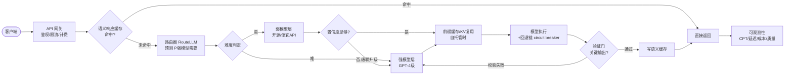

# LLM API 聚合网关：路由 + 缓存架构设计

> 基于《LLM 编排优化分析》落地。核心目标：在质量-成本-延迟三角上做帕累托推进。
> 关键技术依据：RouteLLM(2406.18665) 路由、Marconi(2411.19379) 前缀缓存、LMEdge(2607.17175) QoS 调度、求解器接地(2607.18147) 验证门。

---

## 1. 总体架构

## 2. 核心组件

| 组件 | 职责 | 技术依据 | 关键参数 |
|---|---|---|---|
| 语义响应缓存 | 相似请求直接返回，零成本 | 响应级缓存 | 相似度阈值、TTL |
| 路由器 RouteLLM | 预测 P(强模型赢\|q)，分流 | 2406.18665 | CPT 阈值=SLA |
| 前缀缓存 | 复用 system prompt 的 KV | Marconi 2411.19379 | 共享前缀命中率 |
| 模型注册表 | 各供应商能力/成本/延迟元数据 | LMEdge 2607.17175 | per-(模型×量化×位置) |
| 回退链 | 超时/报错自动降级备选供应商 | circuit breaker | 重试/熔断阈值 |
| 验证门 | 关键输出过校验才返回 | 求解器接地 2607.18147 | 触发条件 |
| 可观测性 | CPT/延迟/成本/质量追踪 | RouteLLM 度量 | APGR 曲线 |

## 3. 请求流（带数据）

1. **客户端** -> 网关鉴权限流
2. **语义缓存**：embedding 相似度 > 阈值 -> 直接返回（命中即零成本）
3. **路由器**：RouteLLM(Matrix Factorization) 算 P(强模型需要)
   - P < 阈值_low -> 弱模型；P > 阈值_high -> 强模型；中间 -> 级联
4. **级联**：弱模型先答 -> 置信度低才升级强模型（成本最优）
5. **前缀缓存**：自托管模型复用共享 system prompt 的 KV（首 token 延迟↓）
6. **执行 + 回退**：主供应商失败 -> 熔断 -> 备选供应商
7. **验证门**：关键/数值输出过校验（失败回强模型重算）
8. **写缓存** + 返回 + 上报指标

## 4. 路由器实现要点（RouteLLM 落地）

- **模型选型**：Matrix Factorization（GPU，155 req/s，$3.32/M 请求，性价比最高）；无 GPU 用 BERT（$3.19/M，70 req/s）。
- **训练数据**：偏好数据 D_pref（强弱模型回答的人工/裁判偏好）。加裁判数据 D_judge 后 CPT(50%) 从 19.58%→13.40%，**数据增强收益巨大**。
- **阈值即 SLA**：CPT 阈值直接换算"愿意花多少强模型调用占比"，业务可调。例：CPT(50%) 用强模型仅 13.4% 调用，质量达 GPT-4 的 95%。
- **二元起步**：先做强/弱二元路由，再扩 N-way（多供应商）。
- **成本节省**：相对纯强模型 MT Bench 3.66x（95% 质量）。

## 5. 缓存两层

| 层 | 粒度 | 适用 | 命中条件 |
|---|---|---|---|
| 语义响应缓存 | 整条响应 | 所有（含转发第三方 API） | query embedding 相似度 > 阈值 |
| 前缀 KV 缓存 | system prompt 的 KV | 仅自托管模型 | 前缀完全匹配 |

- 聚合场景共享 system prompt 多，前缀缓存命中率高。
- 语义缓存需处理过期/失效（模型更新、数据时效）。

## 6. 落地路线（P0->P2）

| 阶段 | 动作 | 预期收益 |
|---|---|---|
| P0 | 语义响应缓存 + 强弱级联（规则版） | 命中零成本 + 简单请求不烧钱 |
| P0 | 训 RouteLLM 路由器替换规则 | 同质量成本降 2-3x |
| P1 | 回退链 + 验证门 | 可靠性 + 质量 |
| P1 | QoS 感知调度（多供应商 SLA） | 异构下达标 |
| P2 | 自托管前缀缓存 + 量化/投机解码 | 延迟/吞吐 |

## 7. 风险与对策

- **路由器 OOD 泛化**：偏好数据外的查询路由可能错 -> 级联兜底 + 监控路由错误率。
- **缓存失效**：模型升级后旧响应过期 -> 版本号绑定 + TTL。
- **验证门开销**：只对关键输出触发，避免全量校验拖延迟。
- **路由开销**：Matrix Factorization $3.32/M 请求，远小于生成成本，可接受。

---

*文件位置：`/Users/earan/Documents/llm-orchestrator/LLM聚合网关架构设计.md`*
